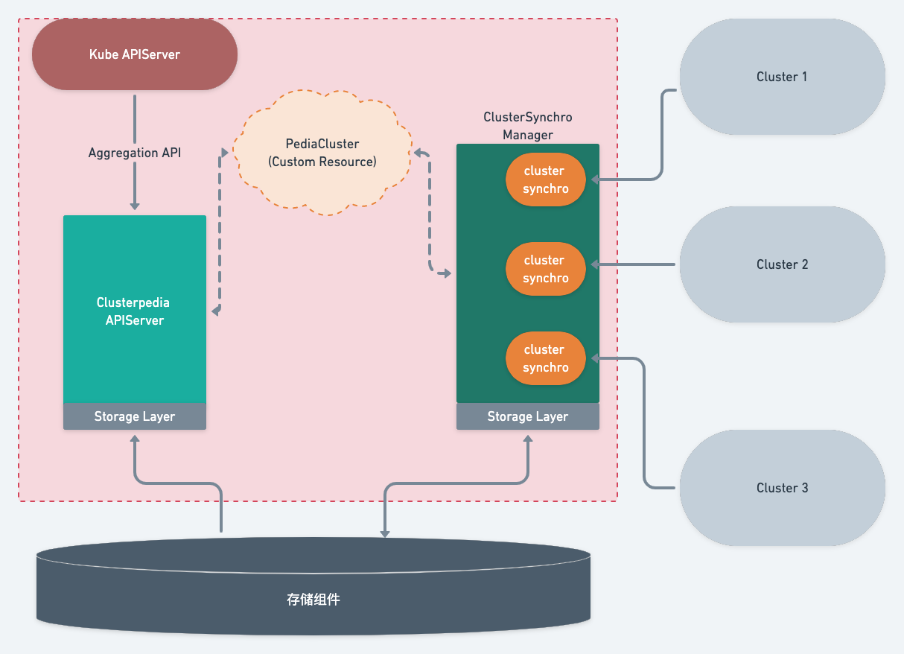

<div align="center"></div>
<p align="center">
  <b>The Encyclopedia of Kubernetes clusters</b>
</p>

# Clusterpedia

[](/LICENSE)
[](https://goreportcard.com/report/github.com/clusterpedia-io/clusterpedia)
[](https://github.com/clusterpedia-io/clusterpedia/releases)
[](https://artifacthub.io/packages/search?repo=clusterpedia)
[](https://bestpractices.coreinfrastructure.org/projects/5539)
[](https://cloud-native.slack.com/messages/clusterpedia)

This name Clusterpedia is inspired by Wikipedia. It is an encyclopedia of multi-cluster to synchronize, search for, and simply control multi-cluster resources. 

Clusterpedia can synchronize resources with multiple clusters and provide more powerful search features on the basis of compatibility with Kubernetes OpenAPI to help you effectively get any multi-cluster resource that you are looking for in a quick and easy way.  

> The capability of Clusterpedia is not only to search for and view but also simply control resources in the future, just like Wikipedia that supports for editing entries.


**Clusterpedia is a [Cloud Native Computing Foundation](https://cncf.io/) sandbox project.**
> If you want to join the clusterpedia channel on CNCF slack, please **[get invite to CNCF slack](https://slack.cncf.io/)** and then join the [#clusterpedia](https://cloud-native.slack.com/messages/clusterpedia) channel.

## Why Clusterpedia
Clusterpedia can be deployed as a standalone platform or integrated with [Cluster API](https://github.com/kubernetes-sigs/cluster-api), [Karmada](https://github.com/karmada-io/karmada), [Clusternet](https://github.com/clusternet/clusternet) and other multi-cloud platforms

### Automatic synchronization of clusters managed by multi-cloud platforms
The clusterpedia can automatically synchronize the resources within the cluster managed by the multi-cloud platform.

Users do not need to maintain Clusterpedia manually, Clusterpedia can work as well as the internal components of the multi-cloud platforms.

Lean More About [Interfacing to Multi-Cloud Platforms](https://clusterpedia.io/docs/usage/interfacing-to-multi-cloud-platforms/)

### More retrieval features and compatibility with **Kubernetes OpenAPI**
* Support for retrieving resources using `kubectl`, `client-go` or `controller-runtime/client`, [client-go example](https://github.com/clusterpedia-io/client-go/blob/main/examples/list-clusterpedia-resources/main.go)
* The resource metadata can be retrived via API or [client-go/metadata](https://pkg.go.dev/k8s.io/client-go/metadata)
* Rich retrieval conditions: [Filter by cluster/namespace/name/creation](https://clusterpedia.io/docs/usage/search/multi-cluster/#basic-features), [Search by parent or ancestor owner](https://clusterpedia.io/docs/usage/search/multi-cluster/#search-by-parent-or-ancestor-owner),[Multi-Cluster Label Selector](https://clusterpedia.io/docs/usage/search/#label-selector), [Enhanced Field Selector](https://clusterpedia.io/docs/usage/search/#field-selector), [Custom Search Conditions](https://clusterpedia.io/docs/usage/search/#advanced-searchcustom-conditional-search), etc.
### Support for importing Kubernetes 1.10+
### Automic conversion of different versions of Kube resources and support for multiple version of resources
* Even if you import different version of Kube, we can still use the same resource version to retrieve resources
> For example, we can use `v1`, `v1beta2`, `v1beta1` version to retrieve the Deployments resources in different clusters.
> 
>   Notes: The version of *deployments* is `v1beta1` in Kubernetes 1.10 and it is `v1` in Kubernetes 1.24.
```bash
$ kubectl get --raw "/apis/clusterpedia.io/v1beta1/resources/apis/apps" | jq
{
  "kind": "APIGroup",
  "apiVersion": "v1",
  "name": "apps",
  "versions": [
    {
      "groupVersion": "apps/v1",
      "version": "v1"
    },
    {
      "groupVersion": "apps/v1beta2",
      "version": "v1beta2"
    },
    {
      "groupVersion": "apps/v1beta1",
      "version": "v1beta1"
    }
  ],
  "preferredVersion": {
    "groupVersion": "apps/v1",
    "version": "v1"
  }
}
```
### A single API can be used to retrieve different types of resources
* Use [`Collection Resource`](https://clusterpedia.io/docs/concepts/collection-resource/) to retrieve different types of resources, such as `Deployment`, `DaemonSet`, `StatefulSet`.
```bash
$ kubectl get collectionresources
NAME            RESOURCES
any             *
workloads       deployments.apps,daemonsets.apps,statefulsets.apps
kuberesources   .*,*.admission.k8s.io,*.admissionregistration.k8s.io,*.apiextensions.k8s.io,*.apps,*.authentication.k8s.io,*.authorization.k8s.io,*.autoscaling,*.batch,*.certificates.k8s.io,*.coordination.k8s.io,*.discovery.k8s.io,*.events.k8s.io,*.extensions,*.flowcontrol.apiserver.k8s.io,*.imagepolicy.k8s.io,*.internal.apiserver.k8s.io,*.networking.k8s.io,*.node.k8s.io,*.policy,*.rbac.authorization.k8s.io,*.scheduling.k8s.io,*.storage.k8s.io
```
### Diverse policies and intelligent synchronization
* [Wildcards](https://clusterpedia.io/docs/usage/sync-resources/#using-wildcards-to-sync-resources) can be used to sync all types of resources within a specified group or cluster.
* [Support for synchronizing all custom resources](https://clusterpedia.io/docs/usage/sync-resources/#sync-all-custom-resources)
* The type and version of resources that Clusterpedia is synchroizing with can be adapted to you CRD and AA changes
### Unify the search entry for master clusters and multi-cluster resources
* Based on [Aggregated API](https://kubernetes.io/docs/concepts/extend-kubernetes/api-extension/apiserver-aggregation/), the entry portal for multi-cluster retrieval is the same as that of the master cluster(IP:PORT)
### Very low memory usage and weak network optimization
* Optimized caches used by informer, so the memory usage is very low for resource synchronization.
* Automatic start/stop synchronization based on cluster health status
### High availability
### No dependency on specific storage components
Clusterpedia does not care about storage components and uses the storage layer to attach specific storage components,
and will also add storage layers for **graph databases** and **ES** in the future

## Architecture <span id="design"></span>
<div align="center"></div>
The architecture consists of four parts:

* **Clusterpedia APIServer**: Register to `Kubernetes APIServer` by the means of [Aggregated API](https://kubernetes.io/docs/concepts/extend-kubernetes/api-extension/apiserver-aggregation/) and provide services through a unified entrance
* **ClusterSynchro Manager**: Manage the cluster synchro that is used to synchronize cluster resources
* **Storage Layer**: Connect with a specific storage component and then register to Clusterpedia APIServer and ClusterSynchro Manager via a storage layer interface
* **Storage Component**: A specific storage facility such as **MySQL**, **PostgreSQL**, **Redis** or other **Graph Databases**

In addition, Clusterpedia will use the Custom Resource - *PediaCluster* to implement cluster authentication and configure resources for synchronization.

Clusterpedia also provides a `Default Storage Layer` that can connect with **MySQL** and **PostgreSQL**.
> Clusterpedia does not care about the specific storage components used by users,
> you can choose or implement the storage layer according to your own needs,
> and then register the storage layer in Clusterpedia as a plug-in

---
[Installation](https://clusterpedia.io/docs/installation/) | [Import Clusters](https://clusterpedia.io/docs/usage/import-clusters/) | [Sync Cluster Resources](https://clusterpedia.io/docs/usage/sync-resources/)
---

## Search Label and URL Query
|Role| Search label key|URL query|
| -- | --------------- | ------- |
|Filter cluster names|`search.clusterpedia.io/clusters`|`clusters`|
|Filter namespaces|`search.clusterpedia.io/namespaces`|`namespaces`|
|Filter resource names|`search.clusterpedia.io/names`|`names`|
|Fuzzy Search by resource name|`internalstorage.clusterpedia.io/fuzzy-name`|-|
|Since creation time|`search.clusterpedia.io/since`|`since`|
|Before creation time|`search.clusterpedia.io/before`|`before`|
|Specified Owner UID|`search.clusterpedia.io/owner-uid`|`ownerUID`|
|Specified Owner Seniority|`search.clusterpedia.io/owner-seniority`|`ownerSeniority`|
|Specified Owner Name|`search.clusterpedia.io/owner-name`|`ownerName`|
|Specified Owner Group Resource|`search.clusterpedia.io/owner-gr`|`ownerGR`|
|Order by fields|`search.clusterpedia.io/orderby`|`orderby`|
|Set page size|`search.clusterpedia.io/size`|`limit`|
|Set page offset|`search.clusterpedia.io/offset`|`continue`|
|Response include Continue|`search.clusterpedia.io/with-continue`|`withContinue`
|Response include remaining count|`search.clusterpedia.io/with-remaining-count`|`withRemainingCount`
|[Custom Where SQL](https://clusterpedia.io/docs/usage/search/#advanced-searchcustom-conditional-search)|-|`whereSQL`|
|[Get only the metadata of the collection resource](https://clusterpedia.io/docs/usage/search/collection-resource#only-metadata) | - |`onlyMetadata` |
|[Specify the groups of `any collectionresource`](https://clusterpedia.io/docs/usage/search/collection-resource#any-collectionresource) | - | `groups` |
|[Specify the resources of `any collectionresource`](https://clusterpedia.io/docs/usage/search/collection-resource#any-collectionresource) | - | `resources` |

**Both Search Labels and URL Query support same operators as Label Selector:**
* `exist`, `not exist`
* `=`, `==`, `!=`
* `in`, `notin`

More information about [Search Conditions](https://clusterpedia.io/docs/usage/search/),
[Label Selector](https://clusterpedia.io/docs/usage/search/#label-selector) and [Field Selector](https://clusterpedia.io/docs/usage/search/#field-selector)

## Usage Samples
You can search for resources configured in *PediaCluster*, Clusterpedia supports two types of resource search:
* Resources that are compatible with **Kubernetes OpenAPI**
* [`Collection Resource`](https://clusterpedia.io/docs/concepts/collection-resource/)
```sh
$ kubectl api-resources | grep clusterpedia.io
collectionresources     clusterpedia.io/v1beta1  false   CollectionResource
resources               clusterpedia.io/v1beta1  false   Resources
```
### Use a compatible way with Kubernetes OpenAPI
It is possible to search resources via URL, but using `kubectl` may be more convenient if
you [configured the cluster shortcuts for `kubectl`](https://clusterpedia.io/docs/usage/access-clusterpedia/#configure-the-cluster-shortcut-for-kubectl).

We can use `kubectl --cluster <cluster name>` to specify the cluster, if `<cluster name>` is `clusterpedia`,
it meas it is a multi-cluster search operation.

First check which resources are synchronized. We cannot find a resource until it is properly synchronized:
```sh
$ kubectl --cluster clusterpedia api-resources
NAME                  SHORTNAMES   APIVERSION                     NAMESPACED   KIND
configmaps            cm           v1                             true         ConfigMap
events                ev           v1                             true         Event
namespaces            ns           v1                             false        Namespace
nodes                 no           v1                             false        Node
pods                  po           v1                             true         Pod
services              svc          v1                             true         Service
daemonsets            ds           apps/v1                        true         DaemonSet
deployments           deploy       apps/v1                        true         Deployment
replicasets           rs           apps/v1                        true         ReplicaSet
statefulsets          sts          apps/v1                        true         StatefulSet
cronjobs              cj           batch/v1                       true         CronJob
jobs                               batch/v1                       true         Job
clusters                           cluster.kpanda.io/v1alpha1     false        Cluster
ingressclasses                     networking.k8s.io/v1           false        IngressClass
ingresses             ing          networking.k8s.io/v1           true         Ingress
clusterrolebindings                rbac.authorization.k8s.io/v1   false        ClusterRoleBinding
clusterroles                       rbac.authorization.k8s.io/v1   false        ClusterRole
roles                              rbac.authorization.k8s.io/v1   true         Role

$ kubectl --cluster cluster-1 api-resources
...
```

#### Search in Multiple Clusters
> Usage of [multi-cluster search](https://clusterpedia.io/docs/usage/search/multi-cluster/) in documents

**Get deployments in the `kube-system` namespace of all clusters:**
```sh
$ kubectl --cluster clusterpedia get deployments -n kube-system
CLUSTER     NAME                      READY   UP-TO-DATE   AVAILABLE   AGE
cluster-1   coredns                   2/2     2            2           68d
cluster-2   calico-kube-controllers   1/1     1            1           64d
cluster-2   coredns                   2/2     2            2           64d
```

**Get deployments in the two namespaces `kube-system` and `default` of all clusters:**
```sh
$ kubectl --cluster clusterpedia get deployments -A -l "search.clusterpedia.io/namespaces in (kube-system, default)"
NAMESPACE     CLUSTER     NAME                      READY   UP-TO-DATE   AVAILABLE   AGE
kube-system   cluster-1   coredns                   2/2     2            2           68d
kube-system   cluster-2   calico-kube-controllers   1/1     1            1           64d
kube-system   cluster-2   coredns                   2/2     2            2           64d
default       cluster-2   dd-airflow-scheduler      0/1     1            0           54d
default       cluster-2   dd-airflow-web            0/1     1            0           54d
default       cluster-2   hello-world-server        1/1     1            1           27d
default       cluster-2   openldap                  1/1     1            1           41d
default       cluster-2   phpldapadmin              1/1     1            1           41d
```

**Get deployments in the `kube-system` and `default` namespaces in cluster-1 and cluster-2:**
```sh
$ kubectl --cluster clusterpedia get deployments -A -l "search.clusterpedia.io/clusters in (cluster-1, cluster-2),\
     search.clusterpedia.io/namespaces in (kube-system,default)"
NAMESPACE     CLUSTER     NAME                      READY   UP-TO-DATE   AVAILABLE   AGE
kube-system   cluster-1   coredns                   2/2     2            2           68d
kube-system   cluster-2   calico-kube-controllers   1/1     1            1           64d
kube-system   cluster-2   coredns                   2/2     2            2           64d
default       cluster-2   dd-airflow-scheduler      0/1     1            0           54d
default       cluster-2   dd-airflow-web            0/1     1            0           54d
default       cluster-2   hello-world-server        1/1     1            1           27d
default       cluster-2   openldap                  1/1     1            1           41d
default       cluster-2   phpldapadmin              1/1     1            1           41d
```

**Get deployments in the `kube-system` and `default` namespaces in cluster-1 and cluster-2:**
```sh
$ kubectl --cluster clusterpedia get deployments -A -l "search.clusterpedia.io/clusters in (cluster-1, cluster-2),\
    search.clusterpedia.io/namespaces in (kube-system,default),\
    search.clusterpedia.io/orderby=name"
NAMESPACE     CLUSTER     NAME                      READY   UP-TO-DATE   AVAILABLE   AGE
kube-system   cluster-2   calico-kube-controllers   1/1     1            1           64d
kube-system   cluster-1   coredns                   2/2     2            2           68d
kube-system   cluster-2   coredns                   2/2     2            2           64d
default       cluster-2   dd-airflow-scheduler      0/1     1            0           54d
default       cluster-2   dd-airflow-web            0/1     1            0           54d
default       cluster-2   hello-world-server        1/1     1            1           27d
default       cluster-2   openldap                  1/1     1            1           41d
default       cluster-2   phpldapadmin              1/1     1            1           41d
```

#### Search a specific cluster
> Usage of [specified cluster search](https://clusterpedia.io/docs/usage/search/specified-cluster/) in documents

**If you want to search a specific cluster for any resource therein, you can add --cluster to specify the cluster name:**
```sh
$ kubectl --cluster cluster-1 get deployments -A
NAMESPACE                           CLUSTER     NAME                                            READY   UP-TO-DATE   AVAILABLE   AGE
calico-apiserver                    cluster-1   calico-apiserver                                1/1     1            1           68d
calico-system                       cluster-1   calico-kube-controllers                         1/1     1            1           68d
calico-system                       cluster-1   calico-typha                                    1/1     1            1           68d
capi-system                         cluster-1   capi-controller-manager                         1/1     1            1           42d
capi-kubeadm-bootstrap-system       cluster-1   capi-kubeadm-bootstrap-controller-manager       1/1     1            1           42d
capi-kubeadm-control-plane-system   cluster-1   capi-kubeadm-control-plane-controller-manager   1/1     1            1           42d
capv-system                         cluster-1   capv-controller-manager                         1/1     1            1           42d
cert-manager                        cluster-1   cert-manager                                    1/1     1            1           42d
cert-manager                        cluster-1   cert-manager-cainjector                         1/1     1            1           42d
cert-manager                        cluster-1   cert-manager-webhook                            1/1     1            1           42d
clusterpedia-system                 cluster-1   clusterpedia-apiserver                          1/1     1            1           27m
clusterpedia-system                 cluster-1   clusterpedia-clustersynchro-manager             1/1     1            1           27m
clusterpedia-system                 cluster-1   clusterpedia-internalstorage-mysql              1/1     1            1           29m
kube-system                         cluster-1   coredns                                         2/2     2            2           68d
tigera-operator                     cluster-1   tigera-operator                                 1/1     1            1           68d
```
Except for `search.clusterpedia.io/clusters`, the support for other complex queries is same as that for multi-cluster search.

If you want to learn about the details of a resource, you need to specify which cluster it is:
```sh
$ kubectl --cluster cluster-1 -n kube-system get deployments coredns -o wide
CLUSTER     NAME      READY   UP-TO-DATE   AVAILABLE   AGE   CONTAINERS   IMAGES                                                   SELECTOR
cluster-1   coredns   2/2     2            2           68d   coredns      registry.aliyuncs.com/google_containers/coredns:v1.8.4   k8s-app=kube-dns
```

**Find the related pods by the name of the deployment**

First view the deployments in default namespace
```sh
$ kubectl --cluster cluster-1 get deployments
NAME                      READY   UP-TO-DATE   AVAILABLE   AGE
fake-pod                  3/3     3            3           104d
test-controller-manager   0/0     0            0           7d21h
```

Use `owner-name` to specify Owner Name and use `owner-seniority` to promote the Owner's seniority.
```
$ kubectl --cluster cluster-1 get pods -l "search.clusterpedia.io/owner-name=fake-pod,search.clusterpedia.io/owner-seniority=1" 
NAME                                                 READY   STATUS      RESTARTS         AGE
fake-pod-698dfbbd5b-74cjx                            1/1     Running     0                12d
fake-pod-698dfbbd5b-tmcw7                            1/1     Running     0                3s
fake-pod-698dfbbd5b-wvtvw                            1/1     Running     0                3s
```

Lean More About [Search by Parent or Ancestor Owner](https://clusterpedia.io/docs/usage/search/specified-cluster/#search-by-parent-or-ancestor-owner)

### Search for [Collection Resource](https://clusterpedia.io/docs/concepts/collection-resource/)
Clusterpedia can also perform more advanced aggregation of resources. For example, you can use `Collection Resource` to get a set of different resources at once.

Let's first check which `Collection Resource` currently Clusterpedia supports:
```sh
$ kubectl get collectionresources
NAME        RESOURCES
any             *
workloads       deployments.apps,daemonsets.apps,statefulsets.apps
kuberesources   .*,*.admission.k8s.io,*.admissionregistration.k8s.io,*.apiextensions.k8s.io,*.apps,*.authentication.k8s.io,*.authorization.k8s.io,*.autoscaling,*.batch,*.certificates.k8s.io,*.coordination.k8s.io,*.discovery.k8s.io,*.events.k8s.io,*.extensions,*.flowcontrol.apiserver.k8s.io,*.imagepolicy.k8s.io,*.internal.apiserver.k8s.io,*.networking.k8s.io,*.node.k8s.io,*.policy,*.rbac.authorization.k8s.io,*.scheduling.k8s.io,*.storage.k8s.io
```

By getting workloads, you can get a set of resources aggregated by `deployments`, `daemonsets`, and `statefulsets`, and `Collection Resource` also supports for all complex queries.

**`kubectl get collectionresources workloads` will get the corresponding resources of all namespaces in all clusters by default:**
```sh
$ kubectl get collectionresources workloads
CLUSTER     GROUP   VERSION   KIND         NAMESPACE                     NAME                                          AGE
cluster-1   apps    v1        DaemonSet    kube-system                   vsphere-cloud-controller-manager              63d
cluster-2   apps    v1        Deployment   kube-system                   calico-kube-controllers                       109d
cluster-2   apps    v1        Deployment   kube-system                   coredns-coredns                               109d
```
> Add the collection of Daemonset in cluster-1 and some of the above output is cut out

Due to the limitation of kubectl, you cannot use complex queries in kubectl and can only be queried by `URL Query`.

[Lean More](https://clusterpedia.io/docs/usage/search/collection-resource/)

## Proposals
### Perform more complex control over resources<span id="complicated"></span>
In addition to resource search, similar to Wikipedia, Clusterpedia should also have simple capability of resource control, such as watch, create, delete, update, and more.

In fact, a write action is implemented by double write + warning response.

**We will discuss this feature and decide whether we should implement it according to the community needs**

## Notes
### Multi-cluster network connectivity
Clusterpedia does not actually solve the problem of network connectivity in a multi-cluster environment. You can use tools such as [tower](https://github.com/kubesphere/tower) to connect and access sub-clusters, or use [submariner](https://github.com/submariner-io/submariner) or [skupper](https://github.com/skupperproject/skupper) to solve cross-cluster network problems.

## Contact <span id="contact"></span>
If you have any question, feel free to reach out to us in the following ways:
* [@cncf/clusterpedia slack](https://cloud-native.slack.com/messages/clusterpedia)

> If you want to join the clusterpedia channel on CNCF slack, please **[get invite to CNCF slack](https://slack.cncf.io/)** and then join the [#clusterpedia](https://cloud-native.slack.com/messages/clusterpedia) channel.

## Contributors

<a href="https://github.com/clusterpedia-io/clusterpedia/graphs/contributors">
  
</a>

Made with [contrib.rocks](https://contrib.rocks).

## License
Copyright 2023 the Clusterpedia Authors. All rights reserved.

Licensed under the Apache License, Version 2.0.
